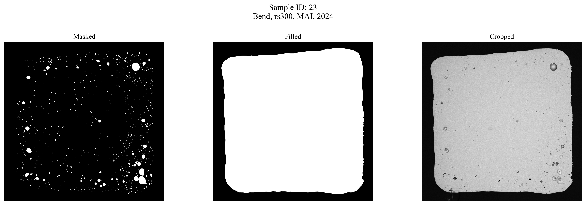
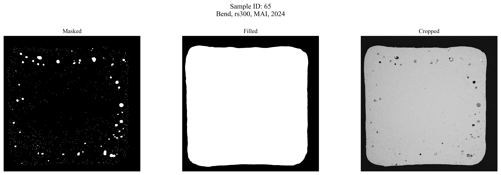

# Обработка изображений поперечных сечений образцов L-PBF

## 📌 Описание проекта

Данный репозиторий содержит код для автоматизированной обработки снимков металлографических образцов, изготовленных методом селективного лазерного сплавления (СЛС или L-PBF). 
Цель проекта — извлечение информации о порах, таких как площадь, расстояние до центра массы, удалённость от краёв и визуализация результатов.

---

## 📁 Структура проекта

- `imageProcessingFuncs.py` — функции обработки изображений, извлечения контуров, расчёта площади и координат пор.
- `processingFuncs.py` — генерация датафрейма с классификацией файлов по типу, компании изготовителю, материалу и т.д.
- `plottingFuncs.py` — визуализация изображений с аннотациями.
- `figures/` — автоматически сохраняемые визуализации для отчётов и анализа.
- `tables/` — итоговые CSV-таблицы с результатами обработки.

---

## ⚙️ Используемые технологии

- Python 3.11+
- OpenCV (`cv2`) — для обработки изображений и поиска контуров
- NumPy / Pandas — для анализа и агрегации данных
- Matplotlib — визуализация результатов

---

## 📊 Пример визуализации

| Пример результата анализа | Множественные представления |
|---------------------------|-----------------------------|
|  |  |

---

## 🧪 Что делает скрипт

1. Загружает изображения маски пор, залитого сечения и опционально SEM-снимка
2. Находит контуры пор
3. Вычисляет центр массы образца
4. Расчитывает расстояния от центра и до краёв
5. Сохраняет:
   - таблицу с результатами (CSV)
   - визуализацию результата (PNG)

---

## 👩‍🔬 Автор проекта
Коробов Константин @ MAI / MAИ

---